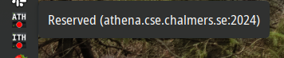
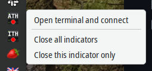

## Resman Status Notifier

On-hover tooltip. Next, I'd like to make this give a bit of info about specifically who has the server reserved.



Right-click menu, giving the option to open an SSH connection to the server in a new terminal. Quite useful for quickly sniping a resman allocation.



This little script takes a config file (which has to be in ~/.config/resman_status/hosts.json), and makes corresponding status bar icons to inform of the resman status in various servers. It looks like the above screenshot.

The config file should have content similar to this. Hopefully the fields are self-explanatory.

```.json
{
    "hosts": [
        {"addr": "some.server.se", "port": 10000, "user": "garby", "short_name": "ATH"},
        {"addr": "other.server.uk", "port": 22, "user": "garby", "short_name": "ITH"}
    ]
}
```

Right now, SSH connections use system-configured SSH keys, which should work out of the box if you do use a key to connect to your server. This doesn't support password auth at the moment.

This script is compatible with Linux, specifically tested with KDE Plasma, but should work with anything that supports Qt6 applications and specifically Qt6 system tray icons. This requirement is, I think, also satisfied by Mac, but I haven't/can't test this myself.

Support for opening up a new terminal in the right click menu calls `xdg-terminal` under the hood, which I'm pretty sure _doesn't_ work on Mac; only Linux systems with XDG support.

### Required packages

Modules which need to be installed are:

 - `paramiko`
 - `PyQt6`

Make a virtual environment and run `pip install paramiko PyQt6`

### Desktop Entry

You can make a desktop entry like the following, and put it in `~/.local/share/applications/resman_status.desktop` or similar. Just make sure you get the path correct.

```
[Desktop Entry]
Version=1.0
Name=Resman Status Checker
Comment=Poll a remote for resman status
Exec=/home/garby/Documents/code/py/resman/resman_icon/.venv/bin/python3 /home/garby/Documents/code/py/resman/resman_icon/main.py
Terminal=false
Type=Application
StartupNotify=true
```
